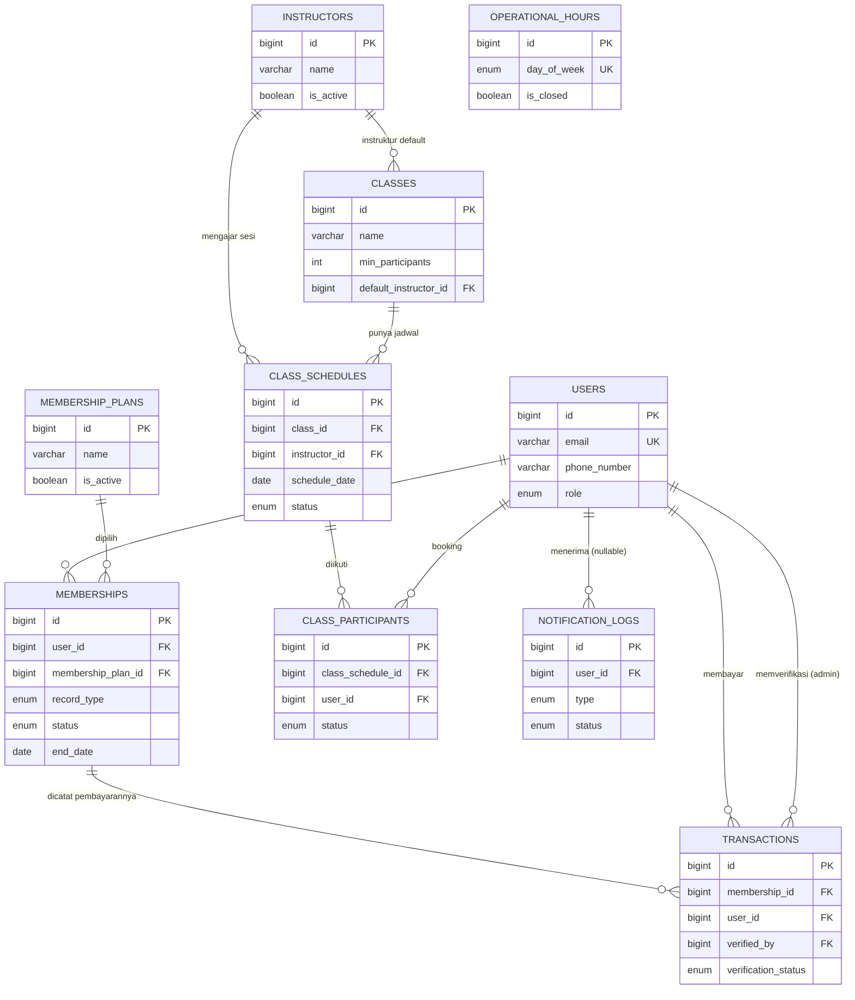

# Rancangan ERD (Revisi, Menunggu Persetujuan Tim) — Sistem Informasi & Manajemen Revira Gym BJM

**Konteks:** Dokumen ini menajamkan rancangan skema database yang sudah digagas di `revira-gym-blueprint.md` (bagian 2) menjadi ERD final untuk tiket **[REV-01] Setup Project & Desain ERD Database** (Sprint 1, Kriteria Selesai: "ERD final disetujui tim"). **Status: draf revisi untuk review tim (SCRUM-35). Migration (SCRUM-36, 37) baru boleh dimulai setelah keempat anggota menyetujui.**. Tetap 10 tabel sesuai lingkup yang sudah disepakati, tapi tiap entitas diberi justifikasi eksplisit dan beberapa constraint krusial yang belum tercantum di draft awal ditambahkan (lihat Bagian 5).

---

## 1. Prinsip Desain

| Prinsip | Alasan |
|---|---|
| Satu tabel `users` untuk admin & member (dibedakan lewat `role`) | Skala proyek kecil, autentikasi seragam via Sanctum; tabel admin terpisah cuma menambah kompleksitas tanpa manfaat nyata. |
| Pisahkan **periode keanggotaan** (`memberships`) dari **catatan pembayaran** (`transactions`) | Dua concern berbeda: "kapan member aktif/berakhir" vs "bagaimana pembayaran itu diverifikasi". Memudahkan query independen (mis. cek member aktif tanpa join ke transaksi). |
| Tidak ada kolom kapasitas maksimum kelas | Aturan bisnis eksplisit dari blueprint: kelas tidak dibatasi jumlah peserta, hanya punya `min_participants`. Kolom "unlimited" yang nullable justru berisiko disalahartikan sebagai "belum diisi". |
| Riwayat, bukan overwrite, untuk `memberships` & `transactions` | Setiap pendaftaran/perpanjangan/percobaan pembayaran baru = baris baru. Admin butuh riwayat lengkap untuk fitur "database member" (US-13), dan ini menghindari race condition saat update status. |
| Jumlah peserta dihitung real-time dari `class_participants`, bukan kolom counter tersimpan | Menghindari bug klasik "counter drift" (counter tidak sinkron dengan data asli). Skala gym kecil, biaya query `COUNT()` masih murah. |
| Soft-delete via `is_active`, bukan hapus baris (instruktur, paket) | `class_schedules` & `memberships` lama tetap harus bisa merujuk instruktur/paket yang sudah tidak aktif, agar riwayat tidak rusak (integritas referensial). |

---

## 2. Diagram ERD

`OPERATIONAL_HOURS` sengaja berdiri sendiri tanpa relasi FK — dicocokkan ke `class_schedules.schedule_date` lewat logika hari-dalam-minggu di aplikasi, bukan lewat foreign key, karena keduanya beroperasi di level abstraksi berbeda (jam buka gym vs jadwal spesifik kelas).

---

## 3. Detail Entitas & Justifikasi

### 3.1 `users`
| Kolom | Tipe | Key | Ket. |
|---|---|---|---|
| id | BIGINT UNSIGNED | PK | |
| name | VARCHAR(100) | | |
| email | VARCHAR(150) | UNIQUE | Login admin & member |
| phone_number | VARCHAR(20) | | Target utama notifikasi WA |
| password | VARCHAR(255) | | Hash |
| role | ENUM('admin','member') | | Menentukan hak akses |
| profile_photo | VARCHAR(255) | NULLABLE | |
| created_at / updated_at | TIMESTAMP | | |

**Justifikasi:** Menggabungkan admin & member dalam satu tabel menghindari duplikasi logika auth (satu middleware role cukup, bukan dua guard terpisah). `phone_number` disimpan permanen di sini karena jadi sumber tunggal nomor WA untuk reminder H-3 (US-06) — jika field ini tersebar di tabel lain, risiko data usang meningkat.

### 3.2 `membership_plans`
| Kolom | Tipe | Key | Ket. |
|---|---|---|---|
| id | BIGINT UNSIGNED | PK | |
| name | VARCHAR(100) | | |
| duration_days | INT | | |
| price | DECIMAL(10,2) | | |
| description | TEXT | NULLABLE | |
| is_active | BOOLEAN | DEFAULT true | |

**Justifikasi:** Master data terpisah supaya admin bisa ubah harga/nonaktifkan paket lewat UI tanpa sentuh kode (US-08). `is_active` dipakai untuk *hide*, bukan *delete* — paket lama tetap harus ada karena `memberships` & `transactions` historis merujuknya; menghapus baris akan memutus integritas riwayat.

### 3.3 `memberships`
| Kolom | Tipe | Key | Ket. |
|---|---|---|---|
| id | BIGINT UNSIGNED | PK | |
| user_id | BIGINT UNSIGNED | FK → users.id | |
| membership_plan_id | BIGINT UNSIGNED | FK → membership_plans.id | |
| record_type | ENUM('registration','extension') | | Jenis catatan: pendaftaran baru atau perpanjangan |
| start_date | DATE | NULLABLE | NULL sebelum diverifikasi admin |
| end_date | DATE | NULLABLE | Dihitung saat membership aktif |
| status | ENUM('pending','active','expired','rejected') | | DEFAULT 'pending' |
| created_at | TIMESTAMP | | |

**Justifikasi:** Mewakili "periode keanggotaan", bukan sekadar status boolean — setiap pendaftaran/perpanjangan jadi baris baru, bukan update baris lama. Ini penting untuk tiga hal: (1) US-13 butuh riwayat member lengkap, bukan cuma status terkini; (2) cron reminder H-3 (US-06) tinggal `WHERE status='active' AND end_date` mendekati, tanpa perlu tahu riwayat lama; (3) jika ditolak lalu member mendaftar ulang, itu baris baru yang bersih, bukan menimpa data penolakan sebelumnya (jejak audit tetap ada).
**Index:** `(user_id, status)`.
**Catatan implementasi (bukan constraint DB, tapi aturan aplikasi):** hanya boleh ada satu baris `status='active'` per `user_id` pada satu waktu, supaya definisi "member aktif" (syarat booking, US-03) tidak ambigu.

### 3.4 `instructors`
| Kolom | Tipe | Key | Ket. |
|---|---|---|---|
| id | BIGINT UNSIGNED | PK | |
| name | VARCHAR(100) | | |
| specialization | VARCHAR(100) | NULLABLE | |
| phone_number | VARCHAR(20) | NULLABLE | |
| is_active | BOOLEAN | DEFAULT true | |

**Justifikasi:** Master data terpisah karena satu instruktur dipakai lintas banyak `classes` dan `class_schedules` — tanpa tabel ini, nama instruktur akan terduplikasi di tiap baris jadwal (rawan inkonsisten penulisan nama). `is_active` (bukan delete) menjaga riwayat sesi lama tetap menampilkan nama instruktur yang benar walau ia sudah berhenti mengajar.

### 3.5 `classes`
| Kolom | Tipe | Key | Ket. |
|---|---|---|---|
| id | BIGINT UNSIGNED | PK | |
| name | VARCHAR(100) | | |
| description | TEXT | NULLABLE | |
| min_participants | INT | | Syarat minimum agar kelas jalan |
| default_instructor_id | BIGINT UNSIGNED | FK → instructors.id, NULLABLE | |

**Justifikasi:** `min_participants` adalah satu-satunya batas kapasitas — **tidak ada kolom `max_participants` sama sekali** (bukan nullable, dihapus total dari skema) sesuai keputusan bisnis eksplisit di blueprint; ini mencegah developer lain di kemudian hari menambahkan validasi "kelas penuh" yang justru bertentangan dengan requirement. `default_instructor_id` hanya prefill form saat admin membuat jadwal baru (REV-08/REV-10) — instruktur aktual per sesi tetap dicatat di `class_schedules.instructor_id`, supaya jika instruktur diganti, sesi yang sudah lewat tidak ikut berubah datanya.

### 3.6 `class_schedules`
| Kolom | Tipe | Key | Ket. |
|---|---|---|---|
| id | BIGINT UNSIGNED | PK | |
| class_id | BIGINT UNSIGNED | FK → classes.id | |
| instructor_id | BIGINT UNSIGNED | FK → instructors.id | |
| schedule_date | DATE | | |
| start_time / end_time | TIME | | |
| status | ENUM('scheduled','ongoing','completed','cancelled') | | |
| cancel_reason | VARCHAR(255) | NULLABLE | |

**Index:** `(schedule_date, status)`.

**Justifikasi:** Ini "instans" spesifik dari sebuah `classes` pada tanggal & jam tertentu — dipisah dari `classes` karena satu jenis kelas (mis. "Zumba") punya banyak sesi berbeda hari/jam/instruktur. `status` adalah kolom kunci untuk fitur real-time (US-01, US-14): frontend polling/WebSocket cukup baca kolom ini tanpa logika tambahan. `cancel_reason` mendukung AC US-02 ("badge Dibatalkan beserta alasan").

### 3.7 `class_participants`
| Kolom | Tipe | Key | Ket. |
|---|---|---|---|
| id | BIGINT UNSIGNED | PK | |
| class_schedule_id | BIGINT UNSIGNED | FK → class_schedules.id | |
| user_id | BIGINT UNSIGNED | FK → users.id | |
| status | ENUM('booked','attended','cancelled') | | |
| booked_at | TIMESTAMP | | |

**Justifikasi:** Tabel junction many-to-many antara member dan sesi kelas, sekaligus jadi sumber tunggal penghitungan peserta (`COUNT(*) WHERE status='booked'`) — dibandingkan real-time dengan `classes.min_participants` untuk UI "6/8 peserta" (US-02) tanpa kolom counter terpisah yang rawan tidak sinkron.
**Tambahan wajib (lihat Bagian 5):** constraint UNIQUE pada `(class_schedule_id, user_id)` — draft awal belum mencantumkan ini, padahal tanpanya member bisa booking dobel di sesi yang sama.

### 3.8 `transactions`
| Kolom | Tipe | Key | Ket. |
|---|---|---|---|
| id | BIGINT UNSIGNED | PK | |
| membership_id | BIGINT UNSIGNED | FK → memberships.id | |
| user_id | BIGINT UNSIGNED | FK → users.id | Pembayar |
| amount | DECIMAL(10,2) | | |
| payment_method | ENUM('transfer','on_the_spot') | | |
| receipt_image | VARCHAR(255) | NULLABLE | Wajib diisi jika `transfer` |
| verification_status | ENUM('pending','verified','rejected') | | DEFAULT 'pending' |
| verified_by | BIGINT UNSIGNED | FK → users.id, NULLABLE | Admin yang approve/reject |
| verified_at | TIMESTAMP | NULLABLE | |
| reject_reason | VARCHAR(255) | NULLABLE | Catatan alasan penolakan jika verifikasi ditolak (AC SCRUM-24). |

**Justifikasi:** Dipisah dari `memberships` supaya proses verifikasi manual (pengganti payment gateway, sesuai konteks proyek) punya jejak audit sendiri: siapa bayar, berapa, lewat metode apa, dan siapa admin yang memverifikasi (`verified_by`) — ini dua FK berbeda ke `users` dalam satu tabel (pembayar vs admin verifikator), pola yang wajar untuk kasus "dua peran berbeda merujuk tabel yang sama". `amount` disimpan di sini (bukan diambil ulang dari `membership_plans.price`) supaya nominal transaksi historis tidak berubah kalau harga paket di-update admin di kemudian hari. `user_id` di tabel ini sebenarnya bisa diturunkan dari `memberships.user_id` (redundan secara teori), tapi dipertahankan agar query "daftar transaksi pending" (US-12 AC1) tidak perlu join ke `memberships` — trade-off kecil aplikasi kecil ini masih wajar, asalkan konsistensinya dijaga di level aplikasi saat insert.

### 3.9 `operational_hours`
| Kolom | Tipe | Key | Ket. |
|---|---|---|---|
| id | BIGINT UNSIGNED | PK | |
| day_of_week | ENUM('Senin',...,'Minggu') | UNIQUE | Satu baris per hari |
| open_time / close_time | TIME | | |
| is_closed | BOOLEAN | DEFAULT false | |

**Justifikasi:** Tabel master sederhana, berdiri sendiri (tanpa FK ke tabel lain) karena jam operasional adalah properti gym secara keseluruhan, bukan milik entitas lain. Sesuai US-10: satu baris per hari cukup untuk mengatur jam buka/tutup dan menandai hari libur.

### 3.10 `notification_logs`
| Kolom | Tipe | Key | Ket. |
|---|---|---|---|
| id | BIGINT UNSIGNED | PK | |
| user_id | BIGINT UNSIGNED | FK → users.id, NULLABLE | NULL = ditujukan ke nomor admin |
| recipient_phone | VARCHAR(20) | NULLABLE | Snapshot nomor WA saat pesan dikirim |
| type | ENUM('new_registration','expiry_reminder','class_cancelled') | | |
| message | TEXT | | |
| sent_at | TIMESTAMP | | |
| status | ENUM('sent','failed') | | |

**Justifikasi:** Tabel log terpisah (bukan sekadar baca dari job queue) supaya ada bukti audit "notifikasi mana yang berhasil/gagal terkirim" — dibutuhkan literal oleh AC US-06 ("tercatat di notification_logs") dan US-15. Memisahkannya dari tabel transaksional lain juga memudahkan pembersihan/arsip log tanpa menyentuh data bisnis inti.

---

## 4. Ringkasan Relasi & Kardinalitas

| Relasi | Kardinalitas | Justifikasi |
|---|---|---|
| `users` → `memberships` | 1 : N | Satu user bisa punya banyak riwayat pendaftaran/perpanjangan sepanjang waktu. |
| `membership_plans` → `memberships` | 1 : N | Satu paket dipakai berkali-kali oleh member berbeda. |
| `memberships` → `transactions` | 1 : N | Struktur mendukung >1 transaksi per periode keanggotaan (mis. pembayaran ulang), meski di alur MVP saat ini umumnya 1:1. |
| `users` → `transactions` (sebagai pembayar) | 1 : N | Satu member bisa punya banyak riwayat transaksi. |
| `users` → `transactions` (sebagai `verified_by`) | 1 : N | Satu admin memverifikasi banyak transaksi; FK kedua ke tabel yang sama, peran berbeda. |
| `instructors` → `classes` (`default_instructor_id`) | 1 : N | Satu instruktur bisa jadi default untuk beberapa jenis kelas. |
| `instructors` → `class_schedules` | 1 : N | Satu instruktur mengajar banyak sesi. |
| `classes` → `class_schedules` | 1 : N | Satu jenis kelas (mis. "Zumba") punya banyak sesi berbeda tanggal/jam. |
| `class_schedules` → `class_participants` | 1 : N | Satu sesi diikuti banyak peserta. |
| `users` → `class_participants` | 1 : N | Satu member bisa booking banyak sesi berbeda. |
| `users` → `notification_logs` | 1 : N (nullable) | NULL dipakai khusus untuk notifikasi ke nomor admin (bukan ke user spesifik). |

---

## 5. Rekomendasi Tambahan (Penyempurnaan dari Draft Blueprint)

Berikut poin yang **belum eksplisit** di draft awal tapi penting ditambahkan sebelum ERD di-*sign-off* di REV-01:

1. **UNIQUE `(class_schedule_id, user_id)` di `class_participants`** — tanpa ini, tidak ada yang mencegah member booking dua kali di sesi yang sama (bug nyata untuk fitur booking).
2. **UNIQUE `day_of_week` di `operational_hours`** — mencegah dua baris konfigurasi untuk hari yang sama.
3. **Hapus total kolom `max_participants`** dari `classes` (bukan sekadar nullable) — didokumentasikan sebagai keputusan bisnis di kode/README, bukan sebagai kolom yang bisa disalahartikan.
4. **Index `(user_id, status)` pada `memberships`** dan **`(schedule_date, status)` pada `class_schedules`** — kedua kombinasi ini paling sering di-query (cek member aktif, cek sesi mendatang & statusnya) untuk dashboard real-time.
5. **Pertimbangkan kolom `recipient_phone`** (snapshot nomor WA saat pesan dikirim) di `notification_logs` — jika `users.phone_number` berubah setelahnya, log tetap mencerminkan nomor yang benar-benar dihubungi.
6. **Larang hard delete** untuk `instructors`, `membership_plans`, dan `classes` di level aplikasi — selalu pakai `is_active=false`, karena semuanya dirujuk oleh data historis (`class_schedules`, `memberships`, `transactions`).
7. **Validasi aplikasi** (bukan constraint DB): hanya satu `memberships.status='active'` yang boleh berlaku per `user_id` pada satu waktu.

---

## 6. Daftar Perubahan dari Draf Awal (untuk Review)

| # | Perubahan | Tabel |
|---|---|---|
| 1 | `notifications_log` diganti `notification_logs` | notification_logs |
| 2 | Kolom `max_participants` tidak ada (hanya `min_participants`) | classes |
| 3 | `memberships.type` diganti `record_type` (`registration` / `extension`) | memberships |
| 4 | UNIQUE `(class_schedule_id, user_id)` | class_participants |
| 5 | UNIQUE `day_of_week` | operational_hours |
| 6 | Index `(user_id, status)` dan `(schedule_date, status)` | memberships, class_schedules |
| 7 | `memberships.start_date` NULLABLE dan `memberships.status` DEFAULT 'pending' | memberships |
| 8 | `transactions.verification_status` DEFAULT 'pending' | transactions |

## 7. Keputusan yang Menunggu Jawaban Tim

Jawab lewat komentar di PR atau di SCRUM-35. Migration jangan dimulai sebelum ini terjawab.

| # | Pertanyaan | Usulan | Jawaban |
|---|---|---|---|
| 1 | `notification_logs.user_id` nullable (NULL = notifikasi ke nomor admin)? | Ya | |
| 2 | Tambah kolom `recipient_phone` di `notification_logs` (snapshot nomor saat pesan dikirim)? | Ya | Ya |
| 3 | Larang hard delete untuk `instructors`, `membership_plans`, `classes` (pakai `is_active`)? | Ya | |
| 4 | Tambah kolom `reject_reason` di `transactions` (dibutuhkan AC SCRUM-24)? | Ya | Ya |

## 8. Persetujuan

| Anggota | Area review | Status |
|---|---|---|
| Dinda | Semua tabel (penulis migration) | Menunggu |
| Ulyani | users, transactions, class_participants | Menunggu |
| Amel | Kolom yang tampil di aplikasi mobile | Menunggu |
| Akbar | Kolom yang tampil di Admin Web | Menunggu |

---

*Dokumen ini melengkapi `revira-gym-blueprint.md` bagian 2 dan siap dipakai sebagai lampiran dokumentasi skema di Confluence untuk REV-01.*
